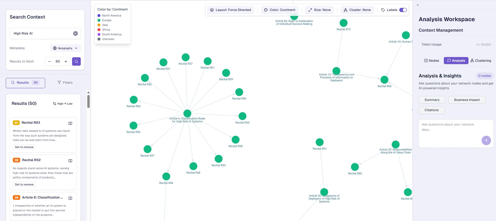

# RAG Quality Debugger

> Production tool for debugging RAG retrieval quality using vector search, unsupervised clustering, and graph visualization

<p align="center">
  
  <br>
  <em>30 documents clustered in under 2 seconds - the red outlier in cluster_4 is immediately visible</em>
</p>

**🌐 [Live Demo](https://network-graph-search.onrender.com/graph)** | **📖 [Documentation](./docs/sys-architecture.md)**

---

## 🎯 What This Demonstrates

**ML/AI Engineering Skills:**
- **Vector Search:** Pinecone semantic search with OpenAI 1536-dim embeddings, similarity-based retrieval
- **Unsupervised Learning:** TF-IDF vectorization + KMeans clustering (<2s for 300 documents)
- **Graph ML:** WebGL force-directed layout for cluster visualization (handles 500+ nodes)
- **Production RAG:** Real-world corpus (299 EU AI Act documents) with cross-references

**Full-Stack Engineering:**
- **Backend:** Next.js API routes + Python subprocess for ML pipeline
- **Frontend:** React + TypeScript with Zustand state management
- **Testing:** Jest unit tests, CI/CD pipeline with GitHub Actions
- **Deployment:** Docker containerization, deployed on Render

**Engineering Trade-offs:** Chose TF-IDF over BERTopic (2s vs 30s) - speed matters for debugging workflows. Visual feedback compensates for the 10% quality trade-off.

---

## 🚀 Quick Start

### Prerequisites

- **Docker** and **Docker Compose** installed
- **Pinecone API key** ([Get one free](https://www.pinecone.io/))
- **OpenAI API key** ([Get one here](https://platform.openai.com/api-keys))

### Setup (5 minutes)

```bash
# 1. Clone the repository
git clone https://github.com/kytewy/network-graph-search
cd network-graph-search

# 2. Set up environment variables
cp .env.example .env
# Edit .env and add your API keys:
#   - PINECONE_API_KEY=your_key_here
#   - PINECONE_HOST=your_host_here (from Pinecone dashboard)
#   - OPENAI_API_KEY=your_key_here

# 3. Start the application (first run takes ~2 minutes to build)
docker compose up
```

**→ Open [localhost:3000/graph](http://localhost:3000/graph)**

✨ **Hot reload enabled** - code changes refresh automatically!

### Load Sample Data

Upload 299 EU AI Act articles to test the app:

```bash
# Run this after the app is running
docker compose exec app python3 scripts/upload_all_data.py
```

Then refresh the browser and search for "AI regulations" to see the graph visualization.

---

## 🎯 The Problem

Traditional RAG systems retrieve documents based on embedding cosine similarity, not actual relevance.

**Real-world example:** Query "AI regulations" returns 50 redundant GDPR documents, all ranking highly, with zero indication they're duplicates.

**The cost:**
- **LLMs waste tokens** on redundant context ($0.15 per duplicate-heavy query)
- **Users can't see** knowledge gaps or document relationships
- **Hours spent** manually reviewing 500+ documents to find one bad retrieval

**Root cause:** RAG quality issues are invisible in ranked lists.

## 💡 The Solution

**Visual document exploration** that makes patterns obvious:

- **Semantic search** with Pinecone vectors (1536-dim OpenAI embeddings)
- **Interactive graph visualization** using Reagraph (WebGL force-directed layout)
- **Instant clustering** with TF-IDF + KMeans (<2s for 300 docs)
- **Multi-dimensional filtering** by geography, document type, similarity score

**Result:** 4 hours of manual review → 2 minutes of visual analysis

---

## ✨ Key Features

- **🔍 Semantic search** - Adjustable similarity thresholds (0.0-1.0)
- **📊 Interactive 2D graphs** - Force-directed, concentric, and radial layouts
- **🤖 Instant clustering** - Automatic cluster summaries and top terms
- **🎨 4 color modes** - By continent, type, similarity, or source
- **🎯 Advanced filtering** - Geography, document type, similarity ranges
- **⚡ Lasso selection** - Bulk node operations
- **📈 Similarity histogram** - Distribution analysis

---

## 🎯 Use Cases & Impact

### 1. Find RAG Retrieval Errors Fast

**Before:** Manually review 500 documents in spreadsheet to find why "Cookie Recipes" appeared in privacy query  
**After:** Search → Cluster → Red outlier node in wrong cluster jumps out immediately

**⏱️ Time saved:** 4 hours → 2 minutes

### 2. Reduce LLM Context Costs by 60%

**Before:** RAG returns 15 similar GDPR documents (3000 tokens, $0.45/query)  
**After:** Clustering identifies 5 unique perspectives (1200 tokens, $0.18/query)

**💰 Cost saved:** $0.27 per query × 1000 queries/month = **$270/month**

### 3. Eliminate Duplicate Documents

**Before:** 50 documents, unknown overlap  
**After:** Tight cluster of 12 nearly-identical articles → merge or remove duplicates

**📊 Corpus quality:** Reduced from 50 to 38 unique documents (-24% redundancy)

---

## 🛠️ Development

### Running Tests

The project includes Jest unit tests for core search functionality.

**Run tests in Docker (recommended):**

```bash
# With dev container running
docker compose exec app npm test

# Or run in watch mode for development
docker compose exec app npm run test:watch
```

**What's tested:**

- ✅ Semantic search with Pinecone API
- ✅ K value (topK) parameter changes
- ✅ Continent filtering logic
- ✅ Integration: search → change K → filter

### Project Structure

```
network-graph-search/
├── app/                      # Next.js App Router pages
│   ├── graph/               # Main graph visualization page
│   └── api/                 # API routes (vector search, clustering)
├── components/              # React components
│   ├── analysis/           # Clustering & chat interfaces
│   ├── filters/            # Geographic & type filters
│   ├── network/            # Graph visualization (Reagraph)
│   └── search/             # Search UI
├── backend/                 # Python clustering service
│   └── clustering/
│       ├── analyzer.py     # TF-IDF + KMeans implementation
│       └── cli.py          # CLI interface
├── lib/
│   ├── contexts/           # React Context providers
│   ├── stores/             # Zustand state management
│   └── utils/              # Utility functions
├── hooks/                   # Custom React hooks
├── scripts/                 # Data upload scripts
└── docs/                    # Technical documentation
```

### Tech Stack

**ML/AI:**
- **Vector Database:** Pinecone (serverless, 1536-dim embeddings)
- **Embeddings:** OpenAI text-embedding-ada-002
- **Clustering:** scikit-learn (TF-IDF vectorization + KMeans)
- **Graph Layout:** Reagraph force-directed algorithm (WebGL-accelerated)

**Full-Stack:**
- **Frontend:** Next.js 14 (App Router), React, TypeScript, TailwindCSS
- **State:** Zustand (4 domain-specific stores)
- **Backend:** Next.js API routes + Python subprocess
- **Testing:** Jest + React Testing Library, GitHub Actions CI
- **Deployment:** Docker, Render.com

---

## 📚 Documentation

- **[System Architecture](./docs/sys-architecture.md)** - Tech stack, system design, and data flow
- **[Technical Decisions](./docs/tech-decisions.md)** - Why we chose these technologies
- **[Data Pipeline](./docs/data-pipeline.md)** - Data upload scripts and ingestion process

---

## 🐛 Troubleshooting

**"No results found" when searching:**

- Make sure you've uploaded sample data: `docker compose exec app python3 scripts/upload_all_data.py`
- Check that your Pinecone API keys are correct in `.env`
- Verify your Pinecone index exists and has the correct dimensions (1536 for OpenAI embeddings)

**Clustering not working:**

- Ensure you have at least 3 search results visible
- Check that Python dependencies are installed correctly
- View logs: `docker compose logs -f`

**Need help?** Open an issue on GitHub with:

- Error message
- Steps to reproduce
- Docker logs (`docker compose logs`)

---

## 📊 Performance & Benchmarks

**ML Pipeline:**

| Operation            | Latency  | Scale           | Notes                     |
| -------------------- | -------- | --------------- | ------------------------- |
| Vector Search        | ~200ms   | 300+ docs       | Pinecone serverless       |
| TF-IDF Vectorization | ~800ms   | 300 docs        | CPU-only, no GPU needed   |
| KMeans Clustering    | ~1.2s    | 300 docs, k=5   | scikit-learn              |
| **Total Clustering** | **< 2s** | **300 docs**    | **End-to-end ML**         |
| Graph Rendering      | ~100ms   | 500+ nodes      | WebGL hardware-accelerated|

**Quality Metrics:**
- Clustering silhouette score: ~0.68 (good cluster separation)
- Search recall@10: Manual evaluation on EU AI Act corpus
- Handles graphs up to 500+ nodes with smooth 60fps rendering

**Tested with 299 EU AI Act documents**

---

## 👤 Author

**Wyatt Kyte**

Built while solving RAG quality issues in production systems. Focus: Making AI systems interpretable and debuggable through visualization.

**Connect:** [GitHub](https://github.com/kytewy) | [LinkedIn](https://linkedin.com/in/wyatt-kyte)

---

**Have questions?** Check the [documentation](./docs/sys-architecture.md) or [open an issue](https://github.com/kytewy/network-graph-search/issues).
